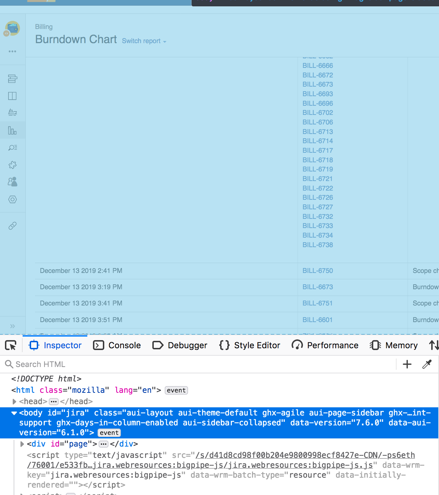

# Jira Parser

This is something I'm writing for work to parse the jira burndown html.

Requires python3 and BeautifulSoup which can be installed using `pip install beautifulsoup4`.

# How to use
Inspect the page and take the body of the HTML using the inspector. Save it to `burndown.html`.

## Example of what to copy:

(I wasn't able to find anything useful via the network tab). Perhaps the JIRA api has something better, but I don't have access to that at work.

Run `python main.py` or `python3 main.py` depending on your alias for python3.

# Stuff I'll do one day
- CSV output? Would anyone even find that useful?
- Generate reports based on date?
- Individual reports. Is this even possible?
- Better exception handling